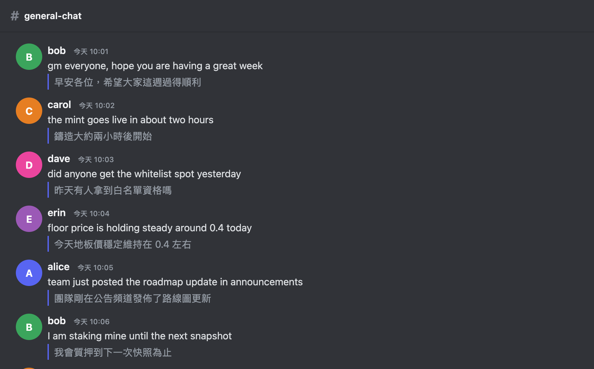
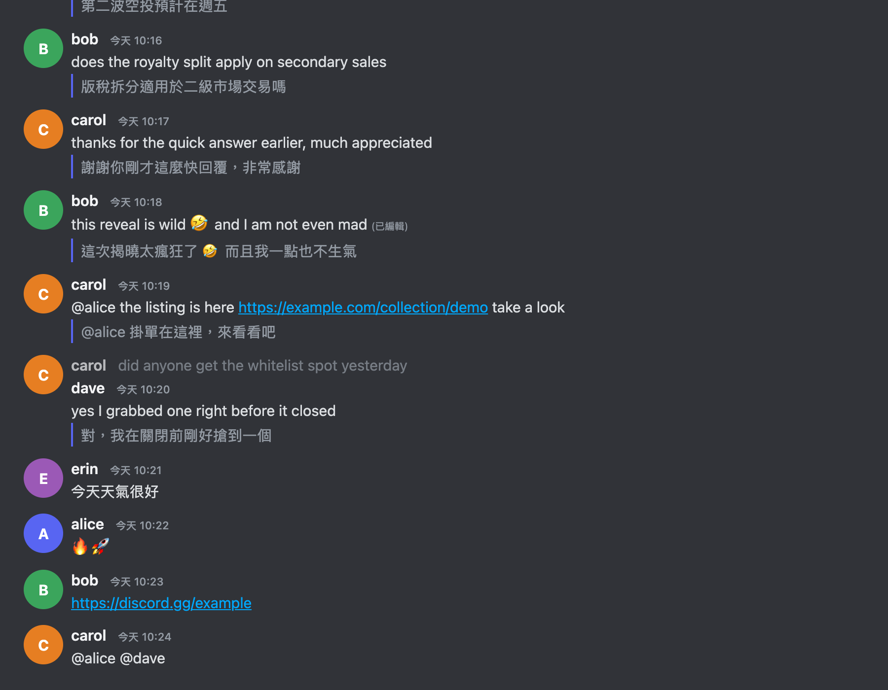
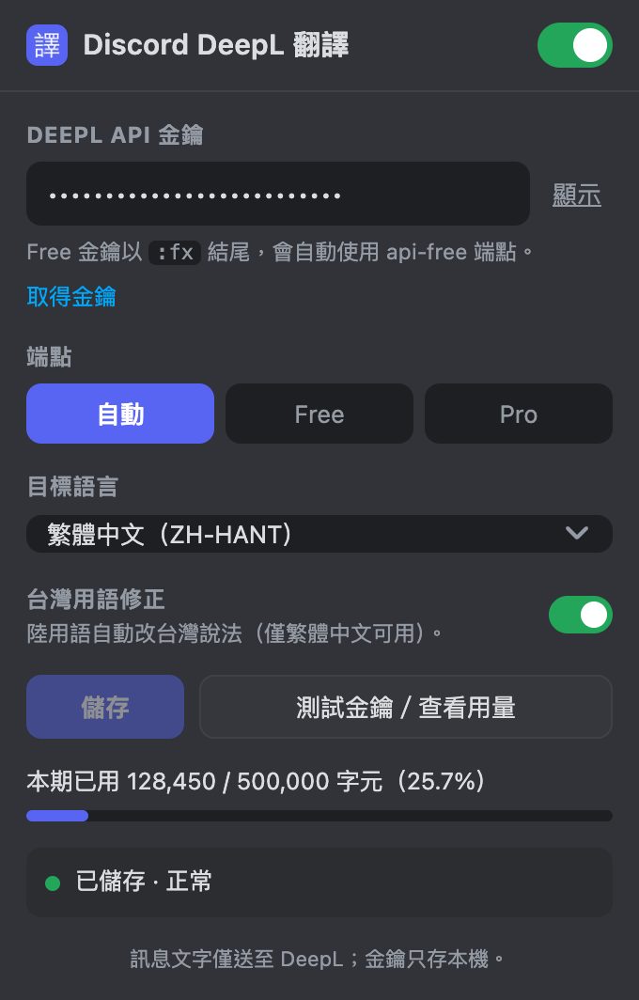

# Discord DeepL 翻譯

用 DeepL 把 Discord 網頁版的聊天訊息自動翻成繁體中文，譯文顯示在原文下方。Chrome 擴充元件（Manifest V3），純 Vanilla JS、零建置、執行期零依賴。

[](https://github.com/noreg0092860/discord-trans/actions/workflows/tests.yml)
[](LICENSE)


> **English**: A Chrome extension (MV3) that auto-translates Discord web chat messages with the DeepL API and renders the translation right under the original text. Your DeepL key is entered in the popup and stored only in `chrome.storage.local`. Quota-conscious by design: viewport-gated, batched, cached, and it skips messages that are already in the target language, emoji-only, URL-only, or mention-only. UI is in Traditional Chinese.



## 目錄

- [功能特色](#功能特色)
- [安裝](#安裝)
- [取得 DeepL API 金鑰](#取得-deepl-api-金鑰)
- [設定](#設定)
- [使用](#使用)
- [隱私與資料流](#隱私與資料流)
- [已知限制](#已知限制)
- [Discord 改版時的修法](#discord-改版時的修法)
- [開發](#開發)
- [貢獻](#貢獻)
- [授權](#授權)

## 功能特色

- **自動翻譯**：捲到哪翻到哪，譯文插在原文下方，不覆蓋原文、不改動 Discord 版面。
- **省額度**：只翻進入視窗的訊息（IntersectionObserver，rootMargin 200px）、300ms 合批（每批 ≤50 則、≤100KB）、譯文快取（鍵＝文字 hash＋目標語言）。
- **智慧跳過**：已是目標語言、純 emoji、純網址、純提及、去雜訊後不足兩個字母的訊息一律不送，不浪費額度。
- **台灣用語修正**：把 DeepL 產出的陸用語（軟件、網絡、視頻、質量…）自動改成台灣說法，共 27 條，可關閉。
- **金鑰不外流**：金鑰只存 `chrome.storage.local`（不用 `storage.sync`，不跨裝置同步）；content script 完全不讀金鑰、不直連網路，所有 DeepL 呼叫都在 background service worker。
- **狀態明確**：popup 可查本期用量；金鑰錯誤（403）或額度用盡（456）時圖示顯示紅色「!」，額度用盡會自動停止送出。

下圖同時展示已編輯訊息照樣翻譯，以及純中文／純 emoji／純網址／純提及被跳過不送：



> 截圖說明：以專案隨附的 Discord 仿真測試頁實際載入擴充元件跑出來的畫面，訊息內容與使用者名稱皆為虛構，可用 `npm run screenshots` 自行重現。

## 安裝

本擴充元件未上架 Chrome 線上應用程式商店，請用開發人員模式載入：

1. 下載本專案（`git clone https://github.com/noreg0092860/discord-trans.git` 或下載 ZIP 後解壓縮）。
2. Chrome 網址列輸入 `chrome://extensions`。
3. 打開右上角的**開發人員模式**。
4. 按左上角**載入未封裝項目**，選擇專案內的 **`extension/` 資料夾**（不是專案根目錄）。
5. 按網址列右側的拼圖圖示，把「Discord DeepL 翻譯」**釘選**到工具列。

裝好後圖示會出現在工具列，但還不會翻譯，要先填金鑰。

## 取得 DeepL API 金鑰

翻譯由 DeepL API 提供，需要自己的金鑰。**注意：DeepL 網頁版或 App 的訂閱不含 API 金鑰**，要另外註冊 DeepL API 方案。

1. 前往 DeepL API 方案頁：<https://www.deepl.com/pro-api>
2. 選擇方案：
   - **DeepL API Free**：免費，每月 50 萬字元（額度以 DeepL 官網公告為準）。個人使用這個就夠。
   - **DeepL API Pro**：付費，依用量計費，無月額度上限。
3. 註冊帳號。DeepL 可能會在註冊過程要求提供付款資料做身分驗證（Free 方案不會因此扣款），實際規定以 DeepL 官網為準。
4. 註冊完成後，到金鑰頁面複製你的 Authentication Key：<https://www.deepl.com/your-account/keys>

金鑰長相與端點對應：

| 方案 | 金鑰結尾 | API 端點 |
|---|---|---|
| API Free | `:fx` | `https://api-free.deepl.com` |
| API Pro | 無 `:fx` | `https://api.deepl.com` |

本擴充元件會依 `:fx` 後綴**自動判斷**要打哪個端點，一般不必手動選；popup 也留了手動指定的選項。

## 設定

點工具列圖示開啟設定畫面：



1. 貼上 **DeepL API 金鑰**（右側「顯示」可切換明碼，檢查有沒有貼錯）。
2. **端點**維持「自動」即可。
3. **目標語言**預設「繁體中文（ZH-HANT）」，另可選簡體中文、英文（美）、日文、韓文。
4. **台灣用語修正**預設開啟，僅在目標語言為繁體中文時作用。
5. 按**儲存**，再按**測試金鑰／查看用量**確認可連線，下方會顯示「本期已用 X / Y 字元（Z%）」。
6. 標題列右側的開關可隨時停用翻譯：關閉會移除頁面上所有譯文，重新開啟由快取回復，不再耗額度。

## 使用

開啟 `discord.com` 任一頻道，**捲到哪翻到哪**。進入視窗的外語訊息會在下方多出一行灰色譯文，左側有一條藍色細線。

- 訊息被編輯 → 自動重譯。
- 切換頻道 → 新頻道續翻。
- 相同文字 → 直接走快取，不重複計費。
- 金鑰填錯或額度用盡 → 圖示顯示紅色「!」；在 popup 按「清除錯誤」或更正金鑰後，先前失敗的訊息會自動補翻。

**與其他翻譯外掛併用**：若已裝其他 Discord 翻譯外掛，建議在 `discord.com` 停用其中一個，否則同一則訊息會出現兩份譯文。本擴充元件只會避免自身重複，無法避免他者。

## 隱私與資料流

- **會送出的**：只有你捲到、且通過跳過規則的訊息文字，送往 DeepL API 進行翻譯。
- **不會送出的**：使用者名稱、頭像、頻道名稱、伺服器資訊、附件，以及金鑰以外的任何帳號資料。
- **金鑰存放**：只存在你本機的 `chrome.storage.local`，不會同步到其他裝置，不會傳給 DeepL 以外的任何位置。
- **無遙測**：本擴充元件沒有任何分析、追蹤或回報機制，除 DeepL 兩個 API 網域外不對外連線。
- **權限最小化**：`manifest.json` 只要求 `storage` 權限，host 權限只有 `api.deepl.com` 與 `api-free.deepl.com`。

DeepL 如何處理送出的文字，適用 DeepL 自己的隱私政策，請自行評估後再用於敏感對話。

## 已知限制

| # | 限制 | 說明 |
|---|---|---|
| 1 | Discord 改版可能讓錨點失效 | 只用穩定的 id 前綴（`message-content-`、`chat-messages-`、`data-list-id="chat-messages"`），不用會變動的 hash class；修法見下一節 |
| 2 | Free 方案每月 50 萬字元 | 熱鬧的伺服器可能兩週用完；popup 可查用量，超過 80% 進度條轉黃，額度用盡（DeepL 回 HTTP 456）會自動停止送出 |
| 3 | 與其他翻譯外掛重疊 | 會出現雙重譯文，請擇一使用 |
| 4 | 訊息文字會送至第三方 | 見上一節「隱私與資料流」 |
| 5 | `ZH-HANT` 是通用繁中，非台灣專屬 | 以「台灣用語修正」表補救（27 條），非萬全；歧義詞（程序、通過、註冊）刻意不動 |
| 6 | 只翻主訊息內文 | 不翻回覆引用列、embed、附件說明、系統訊息 |

額度估算（每則約 60 字元）：

| 每月字元 | 可翻訊息數 | 換算 |
|---|---|---|
| 500,000（Free） | 約 8,300 則 | 每天約 275 則 |
| 100,000 | 約 1,600 則 | 觀望型使用 |

實際會更省：跳過規則、快取、視窗門控三者都在省。

## Discord 改版時的修法

1. 錨點集中在 `extension/content/content.js` **檔案最上方的 `SELECTORS` 常數**，只改這一處：

   ```js
   const SELECTORS = {
     list: '[data-list-id="chat-messages"]',
     messageItem: 'li[id^="chat-messages-"]',
     messageContent: '[id^="message-content-"]',
     messageContentFallback: '[class*="messageContent"]',
     replyContext: '[id^="message-reply-context-"]',
     accessories: '[id^="message-accessories-"]',
     translation: '.dt-translation',
   };
   ```

2. 診斷：在 Discord 分頁開 DevTools 主控台，把執行環境從 `top` 切到 **Discord DeepL 翻譯**（content script 的隔離環境），輸入：

   ```js
   window.__DT_DEBUG()
   // { tracked, queued, cached, failed, rendered, lastError, settings: { enabled, targetLang } }
   ```

   - `tracked` 為 0 → 選擇器失效，用 `document.querySelectorAll('[id^="message-content-"]').length` 確認 id 前綴是否還在。
   - `tracked` 正常但 `rendered` 為 0 → 看 `lastError`（`AUTH` 金鑰、`QUOTA` 額度、`NETWORK` 連線）。
   - 改完回 `chrome://extensions` 按該擴充元件的**重新載入**，再重整 Discord 分頁。

3. **已編輯訊息**的實際結構為 `<span class="timestamp_…"><span><time><span class="edited_…">(已編輯)</span></time></span><span class="hiddenVisually_…">完整日期</span></span>`。抓字時會跳過 `<time>`、純標記／時間戳包裝，以及 `hiddenVisually` 這類螢幕閱讀器專用的隱藏文字。少了這一步，中文日期會混進正文，DeepL 判為中文來源而不顯示譯文。改錨點時請保留 `extension/lib/shared.js` 的 `_walk` 這三條規則。

4. **回覆引用列**內部會重複使用被引用訊息的 `id="message-content-…"`，同一頁可見同一 id 出現多次。因此程式一律不用 `getElementById`，只用 observer 交付的元素參照，並跳過 `closest('[id^="message-reply-context-"]')` 為真者。改錨點時請保留這條規則。

## 開發

```bash
PLAYWRIGHT_SKIP_BROWSER_DOWNLOAD=1 npm install   # 只裝 playwright 1.60.0（devDependency）
npm run check          # 靜態不變量檢查（語法、manifest 權限、金鑰邊界、錨點規則）
npm run test:unit      # node:test 單元測試（零依賴）
npm run test:e2e       # Playwright 實際載入擴充元件 + mock DeepL + Discord 仿真頁
npm test               # 上述三者依序跑
npm run screenshots    # 重新產生 README 截圖
npm run icons          # 需要時重產圖示（PNG 已附，平常不必跑）
```

需要 Node 22 以上。測試不需要真實 DeepL 金鑰，全程對本機 mock 伺服器跑。

每次 push 與 PR 都會在 GitHub Actions 跑上述檢查（單元測試同時測 Node 22 與 24），設定在 `.github/workflows/tests.yml`。`npm run check` 會擋下幾條專案的安全底線：content script 不得讀取金鑰值或直接連網、不得以 HTML 字串寫入譯文、選擇器不得使用會變動的 Discord hash class、manifest 權限不得擴張。

| 路徑 | 用途 |
|---|---|
| `extension/manifest.json` | MV3 設定；權限只有 `storage`，host 只有兩個 DeepL 網域 |
| `extension/lib/shared.js` | 純函式（content／background／popup／Node 四方共用） |
| `extension/background.js` | service worker：唯一呼叫 DeepL 的地方、重試、錯誤對映、徽章 |
| `extension/content/content.js` | DOM 觀察、抓文字、插入譯文；頂部 `SELECTORS` 為唯一錨點來源 |
| `extension/content/content.css` | 譯文樣式（跟隨 Discord CSS 變數並附後備值） |
| `extension/popup/` | 設定介面（Discord 深色語彙） |
| `scripts/make_icons.py` | 用 PIL 產生 16/48/128 圖示 |
| `scripts/make-screenshots.js` | 產生 README 截圖 |
| `scripts/check-invariants.js` | 靜態不變量檢查（CI 與本機共用） |
| `tests/unit/` | `node:test` 單元測試與最小 DOM stub |
| `tests/mock-deepl.js` | 假 DeepL 伺服器（可切 403/456/429 錯誤模式、記錄請求數） |
| `tests/fixtures/discord-like.html` | Discord 仿真 DOM，含回覆引用列重複 id 的情境 |
| `tests/e2e/` | Playwright 腳本與測試用擴充元件變體產生器 |

## 貢獻

歡迎開 issue 或 PR，中英文皆可。開工前請看 [CONTRIBUTING.md](CONTRIBUTING.md)，那裡有開發環境、測試指令，以及四條由 CI 強制執行的安全底線。

回報問題時**請勿貼出你的 DeepL API 金鑰，也不要貼真實的 Discord 訊息內容或使用者名稱**。開 issue 時選對應的範本，會引導你提供需要的診斷資訊：

| 範本 | 用在 |
|---|---|
| 翻譯失效 | 原本會翻，現在整個頻道都不出現譯文（多半是 Discord 改版） |
| 問題回報 | 譯文有問題、顯示異常、設定畫面出錯 |
| 功能建議 | 新功能或行為調整 |

安全問題（金鑰外流、XSS）請勿開公開 issue，改用 [Security Advisory](https://github.com/noreg0092860/discord-trans/security/advisories/new) 私下回報。

## 授權

[MIT](LICENSE) © Jim Lee

本專案與 Discord 及 DeepL 均無隸屬關係。Discord 是 Discord Inc. 的商標，DeepL 是 DeepL SE 的商標。
